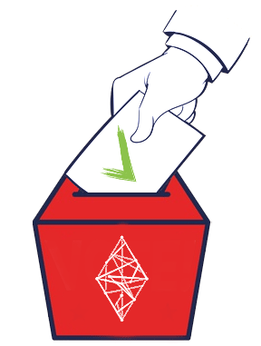

"# election-dapp" 

[![Contributors][contributors-shield]][contributors-url]
[![Forks][forks-shield]][forks-url]
[![Stargazers][stars-shield]][stars-url]
[![Issues][issues-shield]][issues-url]
[![MIT License][license-shield]][license-url]
[![LinkedIn][linkedin-shield]][linkedin-url]


<!-- PROJECT LOGO -->
<br />
<p align="center">
  <a href="https://github.com/davoodmood/election-dapp">
    
  </a>

  <h3 align="center">Election Dapp Sample</h3>

  <p align="center">
    This is a Decentralized APP (DAPP), that is being deployed on Rinkeby test network and is based on Ethereum Virtual Machine.
    <br />
    <br />
    <a href="https://voting.recash.tech">View UI Demo</a>
  </p>
</p>


<!-- TABLE OF CONTENTS -->
<details open="open">
  <summary><h2 style="display: inline-block">Table of Contents</h2></summary>
  <ol>
    <li>
      <a href="#about-the-project">About The Project</a>
      <ul>
        <li><a href="#built-with">Built With</a></li>
      </ul>
    </li>
    <li>
      <a href="#getting-started">Getting Started</a>
      <ul>
        <li><a href="#prerequisites">Prerequisites</a></li>
        <li><a href="#installation">Installation</a></li>
      </ul>
    </li>
    <li><a href="#usage">Usage</a></li>
    <li><a href="#license">License</a></li>
    <li><a href="#contact">Contact</a></li>
    <li><a href="#acknowledgements">Acknowledgements</a></li>
  </ol>
</details>


<!-- ABOUT THE PROJECT -->
## About The Project

[![Election Dapp Screen Shot][product-screenshot]](https://election.dapp.recash.tech)


### Built With

* [Ganache](https://www.trufflesuite.com/ganache)
* [Truffle](https://www.trufflesuite.com/)
* [Solidity](https://soliditylang.org/)


<!-- GETTING STARTED -->
## Getting Started

Clone this repo on your local machine. 

### Prerequisites

This project was build in 2018, and uploaded to github 2021. So you might want to review the code while updating the dependencies to latest, otherwise just install without ...@latest
* npm
  ```sh
  npm install npm@latest -g
  ```

### Installation

1. Clone the repo
   ```sh
   git clone https://github.com/davoodmood/election-dapp.git
   ```
2. Install NPM packages
   ```sh
   npm install
   ```


<!-- USAGE EXAMPLES -->
## Usage

To run the project: 
```sh
npm run dev
```

To test the code: 
```sh
npm run test
```
Additionally you need to have [Meta Mask](https://metamask.io/)_ installed to communicate with the EVM.
Currently sample project is on the Rinkeby Test Network.


<!-- LICENSE -->
## License

Distributed under the ISC License. See `LICENSE` for more information.


<!-- CONTACT -->
## Contact

David H Mood - [@davidmood](https://twitter.com/davidmood) - Send me a message on twitter

Project Link: [https://github.com/davoodmood/election-dapp](https://github.com/davoodmood/election-dapp)


<!-- ACKNOWLEDGEMENTS -->
## Acknowledgements

* []()
* []()
* []()


<!-- MARKDOWN LINKS & IMAGES -->
<!-- https://www.markdownguide.org/basic-syntax/#reference-style-links -->
[contributors-shield]: https://img.shields.io/github/contributors/davoodmood/repo.svg?style=for-the-badge
[contributors-url]: https://github.com/davoodmood/election-dapp/graphs/contributors
[forks-shield]: https://img.shields.io/github/forks/davoodmood/election-dapp.svg?style=for-the-badge
[forks-url]: https://github.com/davoodmood/election-dapp/network/members
[stars-shield]: https://img.shields.io/github/stars/davoodmood/election-dapp.svg?style=for-the-badge
[stars-url]: https://github.com/davoodmood/election-dapp/stargazers
[issues-shield]: https://img.shields.io/github/issues/davoodmood/election-dapp.svg?style=for-the-badge
[issues-url]: https://github.com/davoodmood/election-dapp/issues
[license-shield]: https://img.shields.io/github/license/davoodmood/election-dapp.svg?style=for-the-badge
[license-url]: https://github.com/davoodmood/election-dapp/blob/master/LICENSE.txt
[linkedin-shield]: https://img.shields.io/badge/-LinkedIn-black.svg?style=for-the-badge&logo=linkedin&colorB=555
[linkedin-url]: https://linkedin.com/in/davidmood
